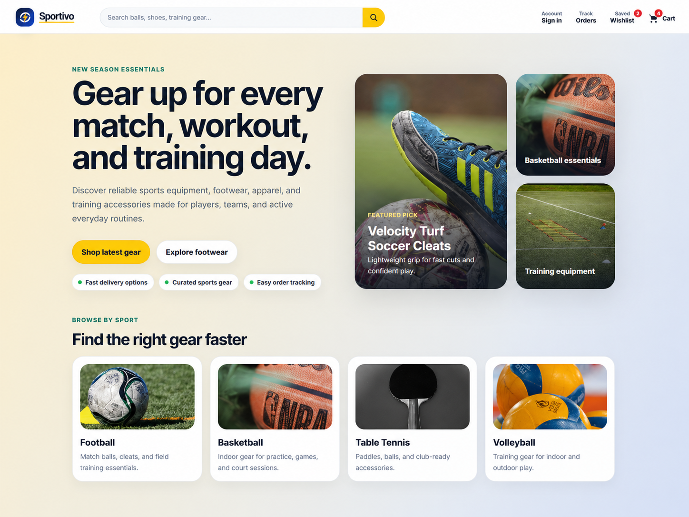

# Sportivo — Sports E-commerce Storefront

Sportivo is a responsive sports e-commerce storefront for browsing athletic gear, comparing products, saving favorites, placing orders, and tracking deliveries. The project is built with semantic HTML, modern CSS, and Vanilla JavaScript modules, with all storefront data handled on the client side.



## Live demo

Add your deployed Netlify link here after publishing:

```txt
https://your-sportivo-site.netlify.app
```

## Highlights

- Modern sports storefront homepage with a custom Sportivo logo and brand system
- Real product photography for football, basketball, volleyball, table tennis, shoes, apparel, and training accessories
- Product catalog with search, sport filters, category filters, price filters, quick filters, sorting, and active filter chips
- Product details page with quantity controls, wishlist actions, buy-now flow, buyer-confidence section, related products, and recently viewed products
- Cart, checkout form, order confirmation, order history, package tracking, and buy-again actions
- Page-aware headers so shopping, checkout, account, orders, tracking, and legal pages each have the right level of navigation
- Responsive layouts for desktop, tablet, and mobile
- Accessibility improvements including skip links, focus-visible states, landmarks, ARIA labels, and reduced-motion support
- Netlify-ready static deployment configuration

## Main pages

| Page | Purpose |
| --- | --- |
| `index.html` | Homepage, product catalog, search, filters, and featured products |
| `product.html` | Product details, buyer confidence, recommendations, and recently viewed products |
| `wishlist.html` | Saved products |
| `checkout.html` | Cart review, customer details, shipping details, and payment selection |
| `order-confirmation.html` | Order success summary and next actions |
| `orders.html` | Order history, order filters, and buy-again actions |
| `tracking.html` | Package tracking timeline and shipment details |
| `login.html` | Account sign-in screen |
| `terms.html`, `privacy.html`, `accessibility.html` | Supporting information pages |
| `404.html` | Custom not-found page for Netlify |

## Tech stack

- HTML5
- CSS3
- Vanilla JavaScript
- JavaScript ES Modules
- Browser storage for cart, wishlist, account state, recently viewed products, and orders
- Netlify static hosting configuration

## Project structure

```txt
.
├── index.html
├── product.html
├── checkout.html
├── order-confirmation.html
├── orders.html
├── tracking.html
├── wishlist.html
├── login.html
├── terms.html
├── privacy.html
├── accessibility.html
├── 404.html
├── sportivo.html
├── data/
├── images/
├── scripts/
├── styles/
├── docs/
│   ├── GITHUB-NETLIFY-INSTRUCTIONS.md
│   ├── DEPLOYMENT-GUIDE.md
│   ├── FINAL-QA-CHECKLIST.md
│   ├── PROJECT-ROADMAP.md
│   └── IMAGE-SOURCES.md
├── CHANGELOG.md
├── LICENSE
├── netlify.toml
└── README.md
```

## Run locally

The project uses JavaScript modules, so the recommended local workflow is to run it through a local server.

### Option 1: VS Code Live Server

1. Open the project folder in VS Code.
2. Right-click `index.html`.
3. Choose **Open with Live Server**.

### Option 2: Python local server

```bash
python -m http.server 5500
```

Then open:

```txt
http://localhost:5500
```

## Deployment

This project is ready for static deployment on Netlify.

Recommended settings:

```txt
Build command: leave empty
Publish directory: .
```

For the complete publishing steps, see [`docs/GITHUB-NETLIFY-INSTRUCTIONS.md`](docs/GITHUB-NETLIFY-INSTRUCTIONS.md).

For the deployment checklist, see [`docs/DEPLOYMENT-GUIDE.md`](docs/DEPLOYMENT-GUIDE.md).

## Quality checklist

Before publishing, review [`docs/FINAL-QA-CHECKLIST.md`](docs/FINAL-QA-CHECKLIST.md).

## Image usage note

Product photography is stored locally in the project and prepared from Pexels stock photography. Product names, prices, inventory numbers, ratings, and descriptions are realistic sample content for a frontend storefront project and do not represent official inventory, official pricing, or brand endorsement. See [`docs/IMAGE-SOURCES.md`](docs/IMAGE-SOURCES.md) for details.

## Roadmap

See [`docs/PROJECT-ROADMAP.md`](docs/PROJECT-ROADMAP.md) for completed improvements and possible future upgrades.

## License

This project is licensed under the MIT License. See [`LICENSE`](LICENSE) for details.

## Author

Built by Yousef Sabbagh as a frontend portfolio project.
